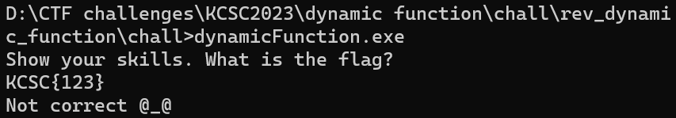
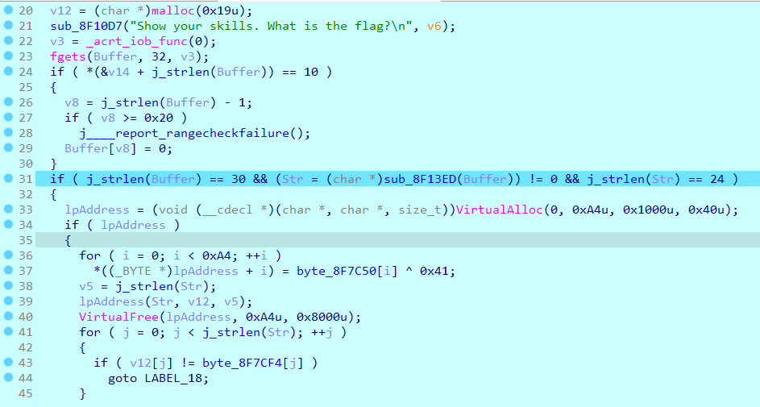
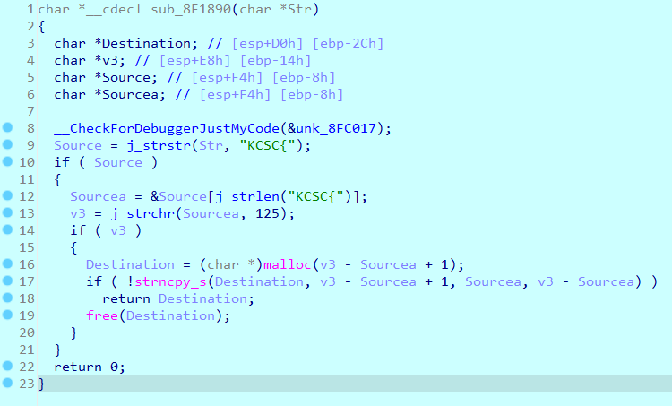
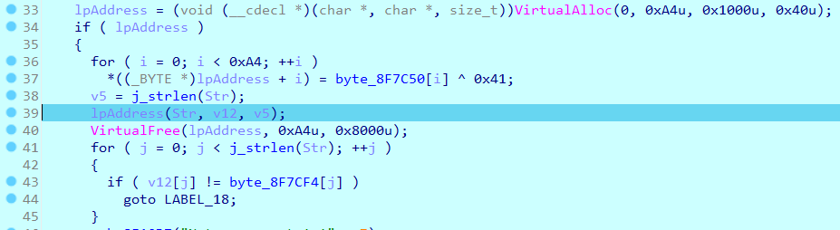
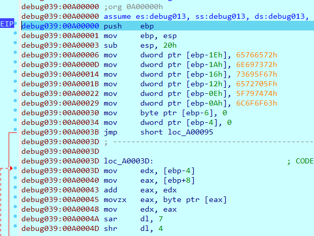
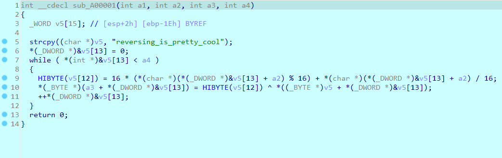
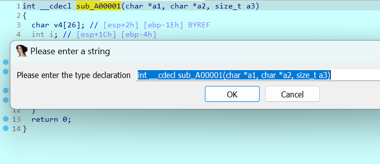
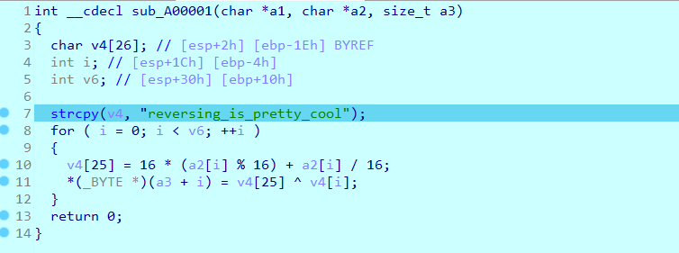
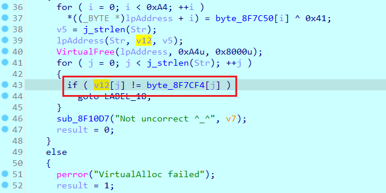

# dynamic function

**Category:** Reverse

**Level:** Intermediate

**Solves:** 3

**Description:** Unless I am in motion, I remain invisible.

**File:** [hide_and_seek](../chall/rev_dynamic_function.rar)

# Solution

Chạy file exe



Mở file exe bằng IDA



Ở đây phần làm các bạn bối rối nhất hẳn là `lpAddress` đúng không?

Ta sẽ tìm hiểu về nó sau, bây giờ vẫn đọc từ đầu đã.

Đoạn đầu dễ hiểu rồi, chỉ là in thông báo. Sau đó xin nhập chuỗi (`fgets`), lưu vào biến `Buffer`.

`if` đầu tiên thay thế ký tự `\n` thành `\0` (kết thúc chuỗi).

`if` thứ hai kiểm tra độ dài chuỗi (phải bằng 30), pass chuỗi vào hàm `sub_8F13ED`, hàm này trả về một chuỗi, lại kiểm tra độ dài chuỗi này (phải bằng 24).

Hàm `sub_8F13ED`:



Hàm này chỉ đơn giản là check flag format. Format cờ phải là `KCSC{...}`.

Sau đó nó trích xuất chuỗi nằm trong cặp dấu ngoặc nhọn, lưu vào `Destination`, trả về `Destination`.

Như đã nói thì `Destination` phải có độ dài bằng 24.

Tiếp đến là `lpAddress`:



Đầu tiên, tạo một vùng nhớ mới (`VirtualAlloc`) với một vài tham số, lần lượt là:
- 0 (`NULL`): Hàm sẽ tự động chọn địa chỉ cho vùng nhớ mới.
- 0xA4: Kích thước vùng nhớ mới.
- 0x1000 (`MEM_COMMIT`): Cấp phát quyền truy cập vùng nhớ mới.
- 0x40 (`PAGE_EXECUTE_READWRITE`): Cấp phát quyền đọc, ghi, thực thi vùng nhớ mới.

Địa chỉ của vùng nhớ mới được lưu vào `lpAddress`.

Tiếp theo chương trình sẽ tạo và ghi từng byte vào vùng nhớ mới, như sau:

```c
for ( i = 0; i < 0xA4; ++i )
{
  *((_BYTE *)lpAddress + i) = byte_8F7C50[i] ^ 0x41;
}
```

Dòng:
```c
lpAddress(Str, v12, v5);
```

Là một lời gọi hàm động, nó sẽ thực thi các lệnh trong vùng nhớ mới.

Làm sao để biết được nó thực thi những gì?

F7 để vào hàm `lpAddress`, lúc này IDA sẽ hiển thị như sau:



Đây chính là mã assembly của hàm `lpAddress`.

Nhưng đọc như thế này hơi khó, chúng ta sẽ dịch ngược nó về C. Bằng cách chuột phải, chọn `Create function`, xong F5.

Vậy là có mã giả C rồi:



Đến đây có thể sửa lại các tham số, biến về đúng kiểu dữ liệu để dễ đọc hơn, bằng cách chuột phải, chọn `Set item type`.



Giờ mã giả C đã rất dễ đọc rồi.



Hàm này sẽ mã hóa từng byte của chuỗi `a2` (chuỗi đầu trích xuất trong {}) theo các bước sau:

Giả sử byte đang xét là tại vị trí `i`:
- swap 4 bit đầu với 4 bit cuối. Ví dụ: `0x41` -> `0x14`.
- xor với `v4[i]` (chuỗi `reversing_is_pretty_cool`).

Cuối cùng, so sánh chuỗi thu được với `byte_8F7CF4`



Script python để giải:

```python
target = [0x44, 0x93, 0x51, 0x42, 0x24, 0x45, 0x2E, 0x9B, 0x01, 0x99, 0x7F, 0x05, 0x4D, 0x47, 0x25, 0x43, 0xA2, 0xE2, 0x3E, 0xAA, 0x85, 0x99, 0x18, 0x7E]
key = "reversing_is_pretty_cool"
flag = ""

for i in range(len(target)):
    tmp = target[i] ^ ord(key[i])
    tmp = ((tmp & 0xF0) >> 4) | ((tmp & 0x0F) << 4)
    flag += chr(tmp)

print("KCSC{" + flag + "}")
```

Flag: `KCSC{correct_flag!submit_now!}`

# Hết


