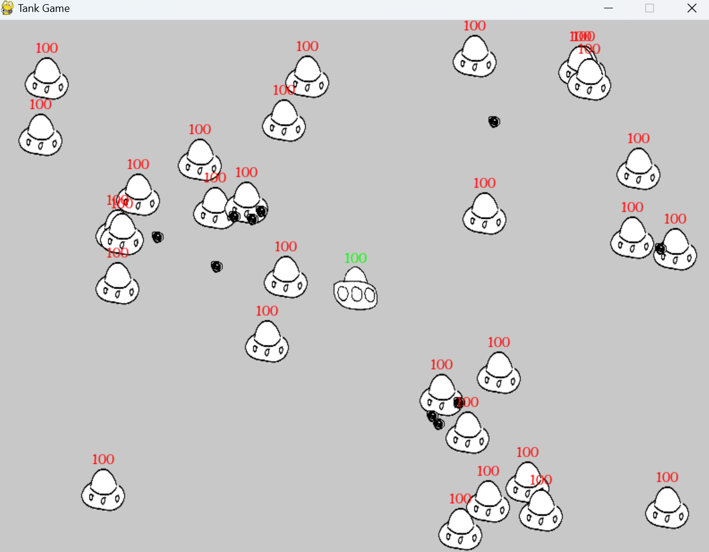
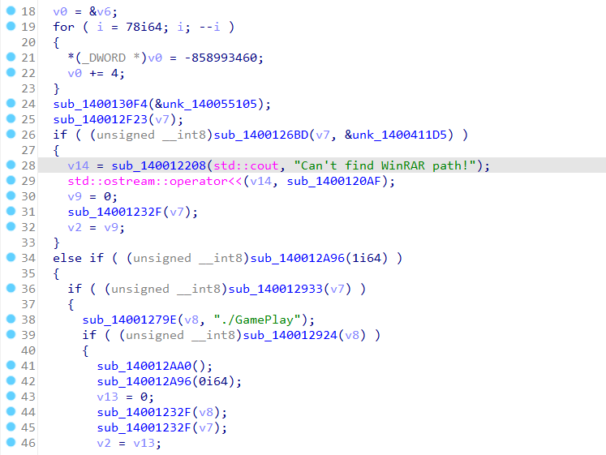
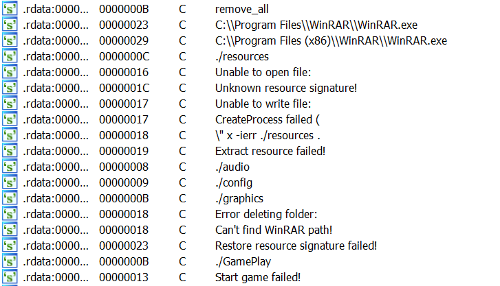
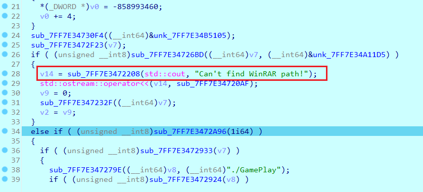
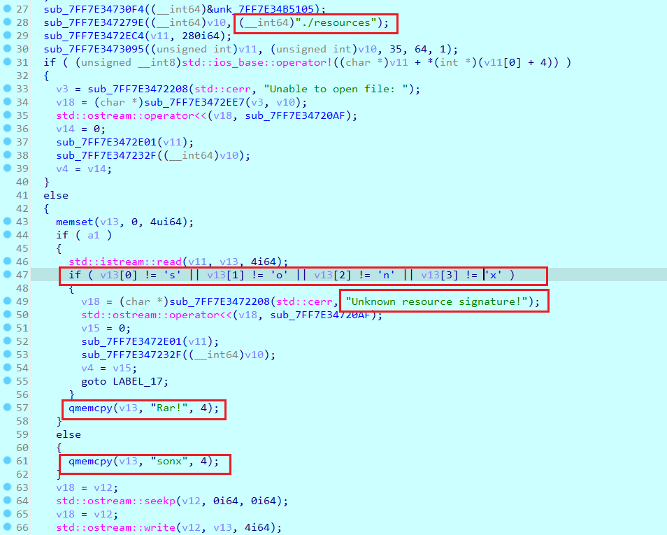
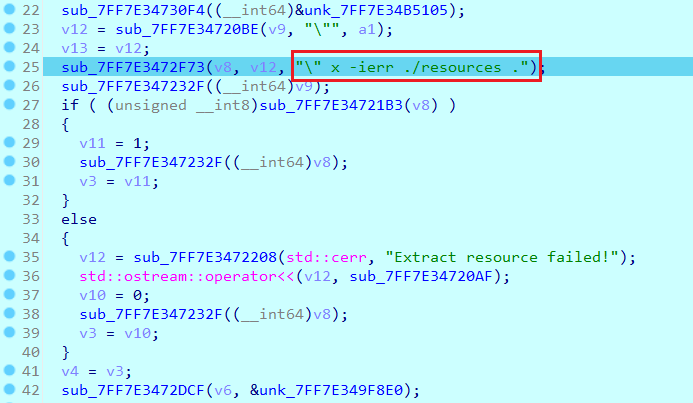
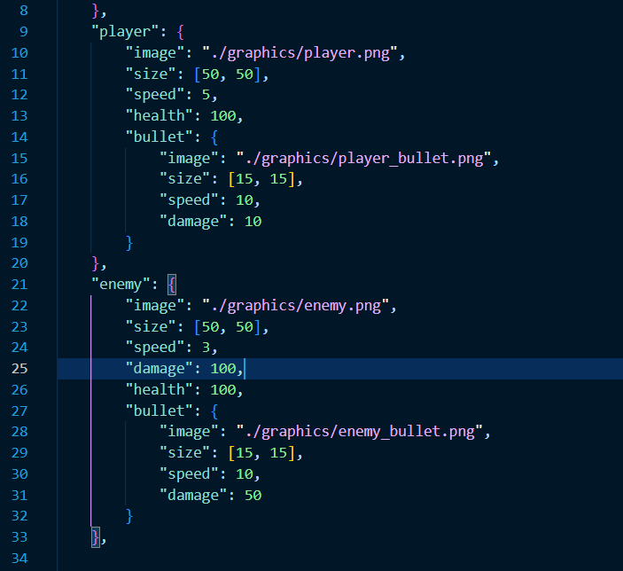
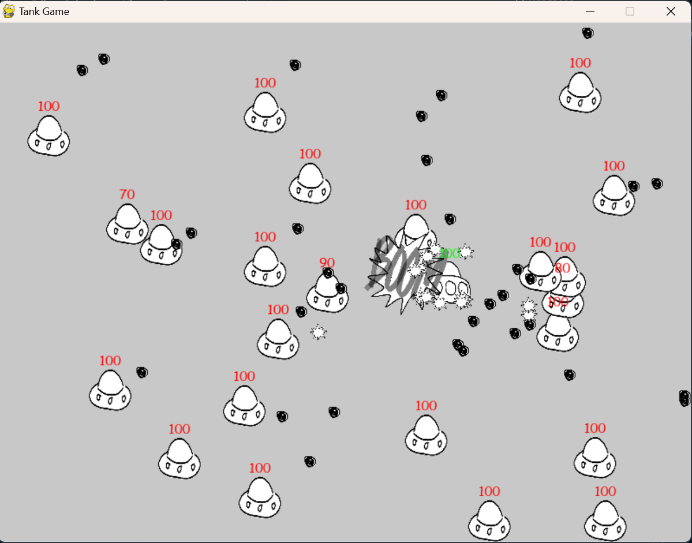
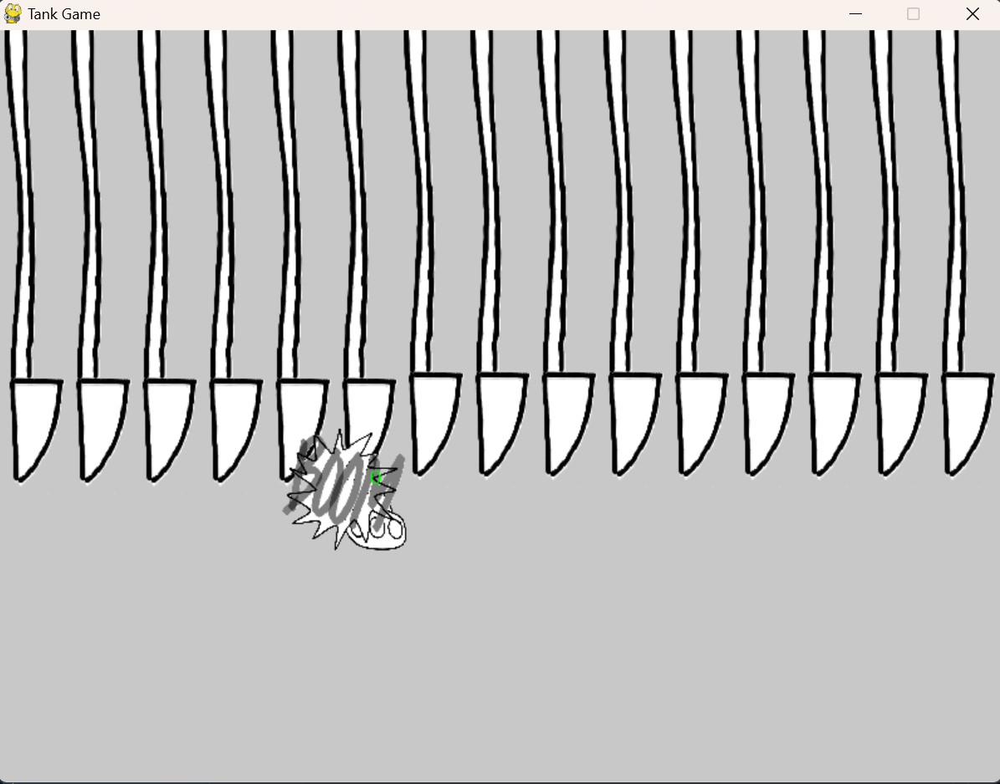
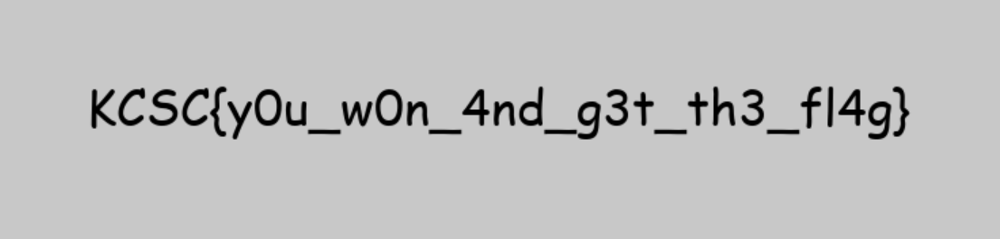

# mission impossible

**Category:** Reverse

**Level:** Intermediate

**Solves:** 0

**Description:** Defeat all the adversaries to protect your base. We're relying on you.

**File:** [mission_impossible](../chall/rev_mission_impossible.rar)

# Solution

Bài này yêu cầu phải thắng game, hạ toàn bộ địch để lấy được cờ.

Nhưng điều này dường như bất khả thi, vì địch quá nhiều, và sát thương của chúng rất lớn.

Vậy phải tìm cách thay đổi điều này, để thắng chúng dễ dàng.

Bài này có lẽ cần debug, chạy thử khá nhiều, nên xin phép không đưa ra các bước debug cụ thể. Tôi sẽ chỉ sơ lược ý tưởng, cách làm.

Mở file exe bằng IDA.

Nhìn code có vẻ khá phức tạp, vậy ở đây xin chuyển hướng tiếp cận khác.

Thay vì đọc lần lượt, ta sẽ tìm các string, chúng có thể là manh mối dẫn đến các hàm quan trọng.

Ở đây có một số chuỗi khá khác biệt:

Có kha khá các chuỗi liên quan đến WinRAR. Vậy có thể file exe này nó dùng WinRAR để giải nén file gì đó. Tuy nhiên chưa biết nó là file nào, dữ liệu gì.

Các chuỗi `C:\Program Files\WinRAR\WinRAR.exe` và `C:\Program Files (x86)\WinRAR\WinRAR.exe` là đường dẫn thường thấy của WinRAR.

Chuỗi `Can't find WinRAR path` là thông báo khi không tìm thấy WinRAR.

Vậy nên có thể nghĩ rằng các đoạn code trên kiểm tra các đường dẫn đã nêu, nếu không tìm thấy thì thông báo lỗi.

Xem hàm điền kiện `else if` ngay dưới:

Ở đây có cái file `./resources`, là file được cấp trong challenge, cùng với hàng loạt các hàm `std::ostream` và `std::istream`.

Hàm đọc các 4 bytes đầu tiên từ `./resources`, kiểm tra từng byte.

Nếu không khớp in ra `Unkown resource format`.

Ở dưới các bạn cũng có thể thấy chuỗi `Rar!` (signature của file RAR) và `sonx` (không rõ là thằng nào).

Về tổng quan, nếu `a1` khác 0, signature là `sonx` thì sửa lại thành `Rar!`.

Nếu `a1` = 0, sửa lại signature thành `sonx`.

Vậy `./resources` là file RAR, và nó được sửa lại signature.

Nên chương trình tìm WinRar để giải nén file này.

Lại ngó qua string window, chuỗi `Extract resource failed` là thông báo khi giải nén thất bại.

Đi đến hàm đó:

Chuỗi `x -ierr ./resources` là lệnh giải nén file `./resources` bằng WinRAR.
- `x`: Extract files
- `-ierr`: Ignore all errors
- `./resources`: File cần giải nén

Tóm gọn quá trình từ đầu đến giờ:
1. Kiểm tra đường dẫn WinRAR
2. Kiểm tra file `./resources`, sửa lại signature
3. Giải nén file `./resources` bằng WinRAR

Sau đó thì chương trình gọi `./GamePlay` vào chơi game.

Trước khi thoát, chương trình xóa các folder giải nén từ `./resources`, sửa lại signature của `./resources` thành `sonx`.

Chắc chắn việc cần làm tiếp theo là phải xem `./resources` nó chứa cái gì.

Sửa lại signature của `./resources` thành `Rar!` và giải nén bằng WinRAR (Thêm extension `.rar` vào `./resources` nếu cần).

Thu được các folder ẩn:

Giờ xem qua các folder này.
- `./audio`: Chứa các file âm thanh
- `./config`: Chứa các file cấu hình
- `./graphics`: Chứa các file hình ảnh

Có file `./config/config.json`, coi như ta hoàn toàn kiểm soát được game.

Việc tiếp theo chỉ là sửa lại các thông số game, sau đó lại nén lại thành file `./resources`, sửa lại signature thành `sonx`, và chạy lại chương trình.

Tuy nhiên, bạn vẫn không thể thắng game, vì tôi có chút bất ngờ sau khi bạn hạ được tất cả địch.

Đùa chút thôi, bạn vẫn sẽ có được flag

### Note:
Nếu bạn vốn đã cài đặt explorer để hiển thị các file/folder ẩn, có thể khi chạy chương trình, bạn sẽ để ý thấy mấy cái folder ẩn này. Đó hẳn là một gợi ý giá trị.

# Hết
