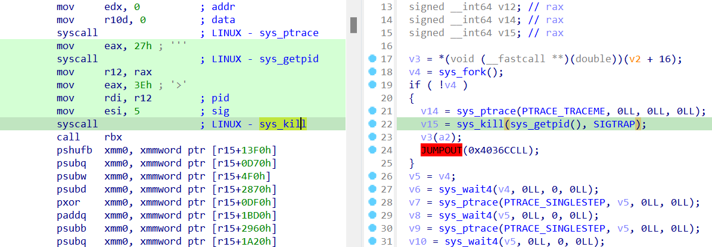
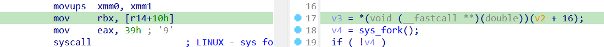
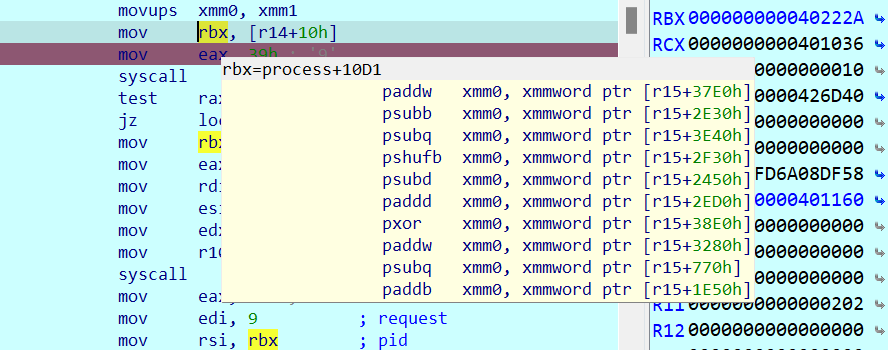
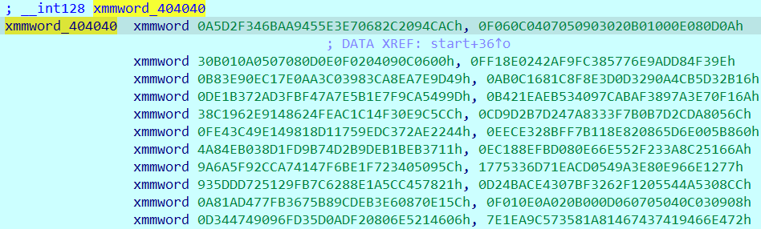
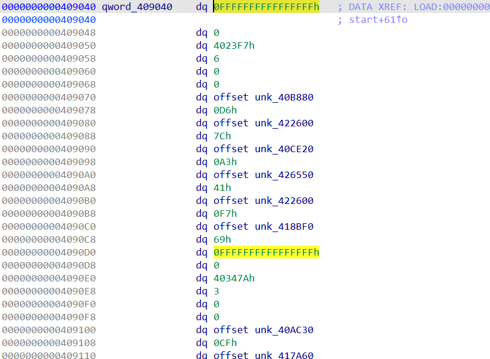
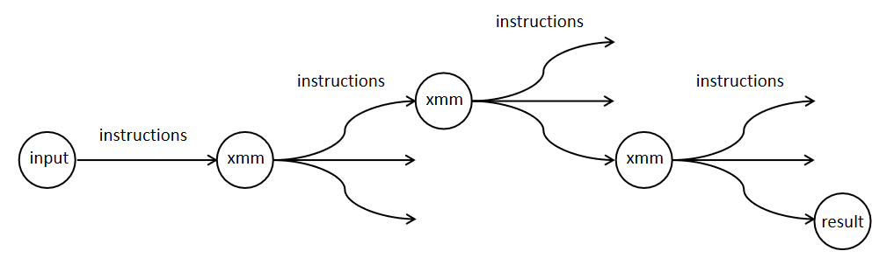
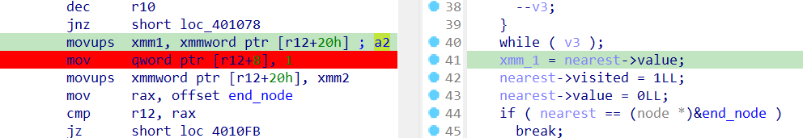
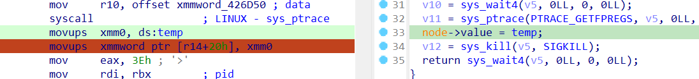

# CrewCTF 2024 Writeup

## Ta, Jr. Skid

```bash!
> ./main
Enter the flag: crew{0123456789}
Incorrect :(
```

IDA cho mã giả như sau:

```cpp=
__int64 __fastcall start(double a1)
{
  signed __int64 v1; // rax
  signed __int64 v2; // rax
  __int64 v3; // r10
  __int64 *v4; // r11
  __int64 *v5; // r12
  __int64 v6; // r13
  __m128i v7; // xmm1
  __int64 v8; // r10
  __int64 *v9; // r11
  unsigned __int64 v10; // rax
  __m128i v11; // xmm1
  signed __int64 v12; // rax
  signed __int64 v13; // rax
  signed __int64 v14; // rax
  signed __int64 v15; // rax
  __int64 *v17; // [rsp-10h] [rbp-10h]
  __int64 v18; // [rsp-8h] [rbp-8h]

  v1 = sys_write(1u, buf, 0x10uLL);
  v2 = sys_read(0, xmmword_426D40, 0x10uLL);
  sub_401159(a1, *(double *)xmmword_426D40, 0.0);
  while ( 1 )
  {
    v3 = 1024LL;
    v4 = (__int64 *)&unk_409040;
    v5 = 0LL;
    v6 = -1LL;
    do
    {
      if ( (unsigned __int64)v6 > *(_OWORD *)v4 )
      {
        v5 = v4;
        v6 = *v4;
      }
      v4 += 2 * v4[3] + 6;
      --v3;
    }
    while ( v3 );
    v7 = *((__m128i *)v5 + 2);
    v5[1] = 1LL;
    *((_OWORD *)v5 + 2) = 0LL;
    if ( v5 == (__int64 *)&unk_40A490 )
      break;
    v8 = v5[3];
    v9 = v5 + 6;
    do
    {
      v18 = v8;
      v17 = v9;
      v10 = v6 + v9[1];
      if ( *(_QWORD *)*v9 > v10 )
      {
        *(_QWORD *)*v9 = v10;
        sub_401159(a1, *(double *)v7.m128i_i64, 0.0);
      }
      v9 = v17 + 2;
      v8 = v18 - 1;
    }
    while ( v18 != 1 );
  }
  v11 = _mm_xor_si128(v7, (__m128i)xmmword_404030);
  if ( !_mm_testz_si128(v11, v11) )
  {
    v12 = sys_write(1u, &buf[25], 0xDuLL);
    v13 = sys_exit(1);
  }
  v14 = sys_write(1u, &buf[16], 9uLL);
  v15 = sys_exit(0);
  return sub_401159(a1, *(double *)v11.m128i_i64, 0.0);
}
```

Chương trình nhận input, sau khi biến đổi khá lằng nhằng thì so với `xmmword_404030`, nếu bằng nhau thì input đúng.

Hàm `sub_401159`

```cpp=
signed __int64 __fastcall sub_401159(double a1, double a2)
{
  __int64 v2; // r14
  void (__fastcall *v3)(double); // rbx
  signed __int64 v4; // rax
  __int64 v5; // rbx
  signed __int64 v6; // rax
  signed __int64 v7; // rax
  signed __int64 v8; // rax
  signed __int64 v9; // rax
  signed __int64 v10; // rax
  signed __int64 v11; // rax
  signed __int64 v12; // rax
  signed __int64 v14; // rax
  signed __int64 v15; // rax

  v3 = *(void (__fastcall **)(double))(v2 + 16);
  v4 = sys_fork();
  if ( !v4 )
  {
    v14 = sys_ptrace(PTRACE_TRACEME, 0LL, 0LL, 0LL);
    v15 = sys_kill(sys_getpid(), SIGTRAP);
    v3(a2);
    JUMPOUT(0x4036CCLL);
  }
  v5 = v4;
  v6 = sys_wait4(v4, 0LL, 0, 0LL);
  v7 = sys_ptrace(PTRACE_SINGLESTEP, v5, 0LL, 0LL);
  v8 = sys_wait4(v5, 0LL, 0, 0LL);
  v9 = sys_ptrace(PTRACE_SINGLESTEP, v5, 0LL, 0LL);
  v10 = sys_wait4(v5, 0LL, 0, 0LL);
  v11 = sys_ptrace(PTRACE_GETFPREGS, v5, 0LL, (unsigned __int64)&unk_426D50);
  *(_OWORD *)(v2 + 32) = xmmword_426DF0;
  v12 = sys_kill(v5, SIGKILL);
  return sys_wait4(v5, 0LL, 0, 0LL);
}
```

Hàm này `fork` ra một tiến trình con, cho chạy vào luồng `if`, sau đó dùng tiến trình cha để điểu khiển.

Cũng may hàm này không khó lắm.

Sau khi tiến trình con gọi `sys_kill(sys_getpid(), SIGTRAP)`, nó tạm dừng hoạt động.

Tiến trình cha sau đó `sys_ptrace` với tham số `PTRACE_SINGLESTEP` 2 lần, bắt tiến trình con thực thi thêm 2 dòng code asm nữa.
Tiếp theo, gọi `sys_ptrace` tham số `PTRACE_GETFPREGS`, lưu giá trị các thanh ghi dấu phẩy động vào `unk_426D50`.

`sys_kill` sau đó kill tiến trình con.
`sys_wait4` dùng để đợi tiến trình con hoàn thành công việc, giúp đồng bộ hóa 2 tiến trình.

Xem mã asm tương ứng.

`call rbx` sẽ được thực thi khi `PTRACE_SINGLESTEP` lần 1



Không debug được tiến trình con, nhưng dễ truy được giá trị `rbx` ở đoạn code ngay bên trên



Sau vài lần tiến hành debug, xem giá trị `rbx` thì thấy nó luôn trỏ đến các instruction trông như thế này



Có rất nhiều instruction mà `rbx` có thể trỏ đến, từ `.text:0000000000401281` đến `.text:00000000004036C3`

Đó cũng là dòng code mà `PTRACE_SINGLESTEP` lần 2 sẽ thực thi.

Xem giá trị `r15`, nó trỏ đến một mảng gồm 1024 'số' 128 bit



Vậy tóm lại hàm `sub_401159`:

- Move giá trị từ xmm1 sang xmm0
- Thực thi một trong các instruction, tính toán trên xmm0 và mảng dữ liệu cho sẵn
- Kết quả cuối cùng được lưu vào xmm0

Trở lại với hàm `start`

ChatGPT cho biết đây 'đây có vẻ là thuật toán tìm đường đi ngắn nhất trên graph, cụ thể hơn là thuật toán Dijkstra'

Có vẻ hợp lý, nhưng nhìn đống code lằng nhằng kia vẫn hơi khó hình dung.

Tôi chắc rằng phải có một kiểu dữ liệu nào đó cho các node trong cái graph kia để code nó dễ đọc hơn.

Nếu đây là Dijkstra thật thì `unk_409040` hẳn là node đầu của graph, `unk_40A490` là node cuối.

Sau khi ngồi debug, phân tích, dần thấy được cấu trúc của các node trong graph.



Không chắc 100%, nhưng đại khái:
- `qword` đầu tiên là khoảng cách đến node nguồn
- `qword` thứ 2 xác định node được ghé hay chưa
- `qword` thứ 3 là địa chỉ của một trong các instruction nói tới trong hàm `sub_401159`
- `qword` thứ 4 là số neighbor của node
- `oword` kế là giá trị được tính bởi `sub_401159`, sẽ được lưu vào `xmm1`
- Sau đó là mảng gồm link và weight đến các neighbor node

Từ đó tạo struct mới với ida

```asm!
00000000 node            struc ; (sizeof=0x60, mappedto_14)
00000000 path_len        dq ?
00000008 visited         dq ?
00000010 instruction     dq ?
00000018 num_links       dq ?
00000020 value           xmmword ?
00000030 neighbor1       dq ?                    ; offset
00000038 weight1         dq ?
00000040 neighbor2       dq ?                    ; offset
00000048 weight2         dq ?
00000050 neighbor3       dq ?                    ; offset
00000058 weight3         dq ?
00000060 node            ends
00000060
```

Sau khi define lại kiểu dữ liệu, rename biến, code dễ đọc hơn rất nhiều.

```cpp=
__int64 __fastcall start(double xmm_0)
{
  signed __int64 v1; // rax
  signed __int64 v2; // rax
  __int64 v3; // r10
  node *v4; // r11
  node *nearest; // r12
  __int64 total_len; // r13
  __int128 xmm_1; // xmm1
  __int64 num_of_links; // r10
  node *p_node1; // r11
  unsigned __int64 v10; // rax
  __m128i v11; // xmm1
  signed __int64 v12; // rax
  signed __int64 v13; // rax
  signed __int64 v14; // rax
  signed __int64 v15; // rax
  node *v17; // [rsp-10h] [rbp-10h]
  __int64 num_of_links_1; // [rsp-8h] [rbp-8h]

  v1 = sys_write(1u, buf, 0x10uLL);
  v2 = sys_read(0, input, 0x10uLL);
  run_instruction(xmm_0, *(double *)input);
  while ( 1 )
  {
    v3 = 1024LL;
    v4 = (node *)&start_node;
    nearest = 0LL;
    total_len = -1LL;
    do                                          // Find the nearest node that hasn't been visited
    {
      if ( (unsigned __int64)total_len > *(_OWORD *)&v4->path_len )
      {
        nearest = v4;
        total_len = v4->path_len;
      }
      v4 = (node *)((char *)v4 + 16 * v4->num_links + 48);// Below node
      --v3;
    }
    while ( v3 );
    xmm_1 = nearest->value;
    nearest->visited = 1LL;
    nearest->value = 0LL;
    if ( nearest == (node *)&end_node )         // Check if the nearest node is the end node
      break;
    num_of_links = nearest->num_links;
    p_node1 = (node *)&nearest->neighbor1;
    do                                          // Traverse all links of the nearest node
    {
      num_of_links_1 = num_of_links;
      v17 = p_node1;
      v10 = total_len + p_node1->visited;
      if ( *(_QWORD *)p_node1->path_len > v10 ) // Update the path length if the new path is shorter
      {
        *(_QWORD *)p_node1->path_len = v10;
        run_instruction(xmm_0, *(double *)&xmm_1);
      }
      p_node1 = (node *)&v17->instruction;
      num_of_links = num_of_links_1 - 1;
    }
    while ( num_of_links_1 != 1 );
  }
  v11 = _mm_xor_si128((__m128i)xmm_1, (__m128i)target);
  if ( !_mm_testz_si128(v11, v11) )
  {
    v12 = sys_write(1u, &buf[25], 0xDuLL);
    v13 = sys_exit(1);
  }
  v14 = sys_write(1u, &buf[16], 9uLL);
  v15 = sys_exit(0);
  return run_instruction(xmm_0, *(double *)v11.m128i_i64);
}
```

Tầm này chắc đúng là thuật toán tìm đường thật, hoặc là dạng custom một chút.

Rename `sub_401159`, thành `run_instruction`. Đặt lại kiểu dữ liệu cũng khiến code trông 'hợp lý' hơn.

```cpp=
signed __int64 __fastcall run_instruction(double a1, double a2)
{
  node *node; // r14
  void (__fastcall *instruction)(double); // rbx
  signed __int64 v4; // rax
  __int64 v5; // rbx
  signed __int64 v6; // rax
  signed __int64 v7; // rax
  signed __int64 v8; // rax
  signed __int64 v9; // rax
  signed __int64 v10; // rax
  signed __int64 v11; // rax
  signed __int64 v12; // rax
  signed __int64 v14; // rax
  signed __int64 v15; // rax

  instruction = (void (__fastcall *)(double))node->instruction;
  v4 = sys_fork();
  if ( !v4 )
  {
    v14 = sys_ptrace(PTRACE_TRACEME, 0LL, 0LL, 0LL);
    v15 = sys_kill(sys_getpid(), SIGTRAP);
    instruction(a2);
    JUMPOUT(0x4036CCLL);
  }
  v5 = v4;
  v6 = sys_wait4(v4, 0LL, 0, 0LL);
  v7 = sys_ptrace(PTRACE_SINGLESTEP, v5, 0LL, 0LL);
  v8 = sys_wait4(v5, 0LL, 0, 0LL);
  v9 = sys_ptrace(PTRACE_SINGLESTEP, v5, 0LL, 0LL);
  v10 = sys_wait4(v5, 0LL, 0, 0LL);
  v11 = sys_ptrace(PTRACE_GETFPREGS, v5, 0LL, (unsigned __int64)&unk_426D50);
  node->value = temp;
  v12 = sys_kill(v5, SIGKILL);
  return sys_wait4(v5, 0LL, 0, 0LL);
}
```

Do toàn bộ đồ thị đã được định sẵn từ đầu, quá trình tìm đường luôn xảy ra giống nhau, không cần biết input nhập vào là gì.

Vậy giờ tôi không quan tâm nó tìm đường như nào nữa.
Tập trung vào hoạt động cốt yếu nhất của chương trình, cách nó tính toán, kiểm tra kết quả.

```cpp=
__int64 __fastcall start(double xmm_0)
{
    xmm0 = input;
    xmm1 = input;
    xmm0 = xmm1;
    instruction xmm0, [r15 + offset];
    node->value = xmm0;
    while ( 1 )
    {
        xmm1 = nearest->value;
        if ( nearest == &end_node ) break;
        do                              // Traverse all links of the nearest node
        {
            if ( node->path_len > len ) // Update the path length if the new path is shorter
            {
                xmm0 = xmm1;
                instruction xmm0, [r15 + offset];
                node->value = xmm0;
            }
        }
        while ( num_of_links != 1 );
    }
    return xmm_1 == target;
}
```

Tóm lại:
- Từ `input`, khởi tạo `xmm0`, `xmm1`
- Thực thi instruction lần 1
- Trong những vòng lặp sau đó, nhiều lần chương trình thực thi instruction để tính `xmm0` dựa trên giá trị tại thanh ghi `xmm1`, nhưng chỉ có một lần `xmm1` được cập nhật mới, bằng một trong các giá trị `xmm0` mới đã được tính ra.

Đây là sơ đồ mô tả tổng quát cách chương trình biến đổi từ input thành kết quả.



Giờ việc cần làm là tìm ra chuỗi các instruction mà chương trình đã dùng.

Ý tưởng là cung cấp input cho chương trình, trong lúc thực thi lấy tất cả các giá trị `xmm1` trong chuỗi biến đổi.

Breakpoint tại `.text:00000000004010A6`, ngay sau khi `xmm1` được cập nhật mới.




```python
import idaapi
import idc
import ida_dbg

BREAKPOINT_ADDRESS = 0x00000000004010A6

def monitor():
    xmm1 = idc.get_reg_value("xmm1")
    xmm1 = int.from_bytes(xmm1, byteorder='little')

    print(hex(xmm1), end = ", ")
    
    idaapi.continue_process()

ida_dbg.add_bpt(BREAKPOINT_ADDRESS, 0, idaapi.BPT_SOFT)

class MyHandler(idaapi.DBG_Hooks):
    def dbg_bpt(self, tid, ea):
        monitor()
        return 0

debugger = MyHandler()
debugger.hook()

print(f"Breakpoint set at {BREAKPOINT_ADDRESS:X}")
print("Run the debugger to start monitoring")
```

Đến đây đã có được toàn bộ giá trị trong chuỗi biến đổi.

Nhưng chưa biết instruction nào đã được thực thi.

Tôi lại nhờ ida thực hiện breakpoint `.text:000000000040121B`, trong hàm `run_instruction`



Lấy giá trị `xmm0`, lúc này đã được tính toán xong bằng instruction. Nếu `xmm0` thuộc chuỗi biến đổi, tìm instruction đã làm việc đó với `idc.generate_disasm_line` tại `[r14 + 10h]`

Vậy là đã có chuỗi các instruction chương trình đã dùng.

Có thể kiểm tra bằng cách code lại chương trình theo hướng đang làm.

Đến đây thì có thể tìm flag bằng cách đảo ngược quá trình.

Code triển khai: [program.py](program/program.py) mô phỏng lại chương trình và [solver.py](solver/solver.py) để tìm flag.

> Flag: crew{a6b4291e38}
