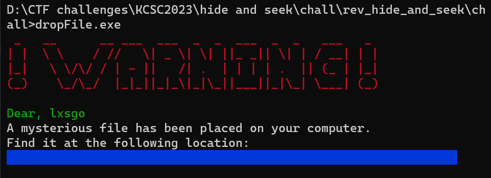
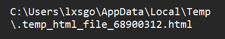
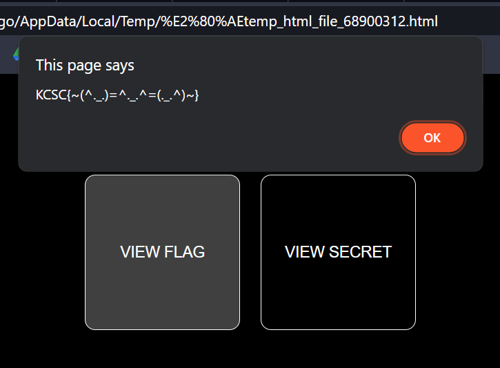
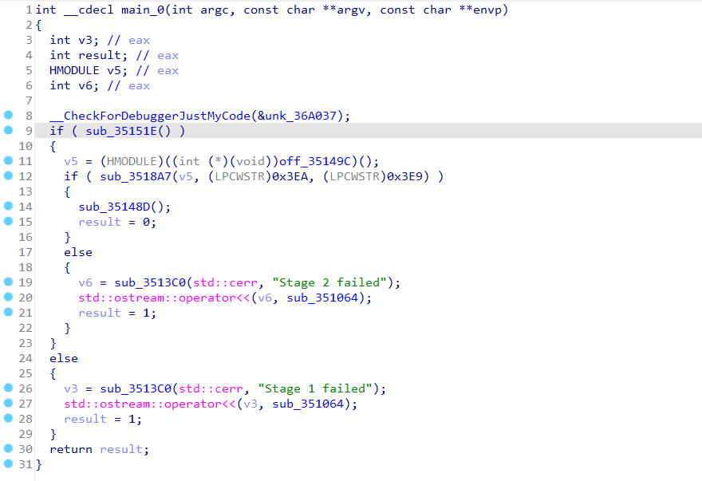
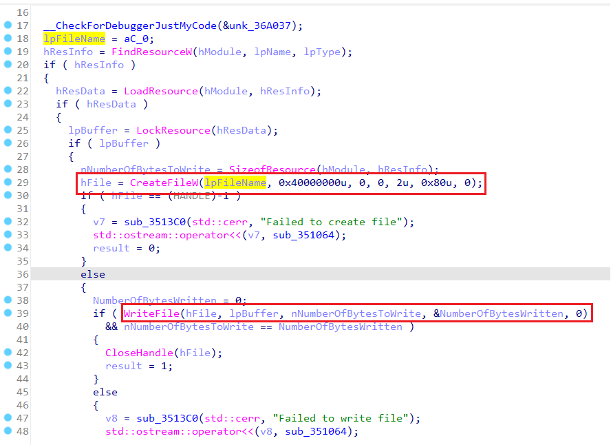

# hide and seek

**Category:** Reverse

**Level:** Easy

**Solves:** 23

**Description:** I hid a little surprise for you somewhere in your computer. Let's see if you can find it!

**File:** [hide_and_seek](../chall/rev_hide_and_seek.rar)

# Solution
## Cách 1:

Run exe

Bài này thực ra không cần reverse gì.

Đường dẫn đến file flag tôi đã in ra bên trong phần khung xanh rồi, chỉ là có set màu chữ trùng với màu nền nên không thấy thôi.

Tất cả những gì các bạn cần làm là Ctrl+C vùng đó và paste ra để xem.

Nó trông như thế này:

Tìm file đó trong máy

Giờ chỉ cần double click, mở nó lên, và nhấn `VIEW FLAG` là xong.

Còn đây là `VIEW SECRET`: [Secret](https://www.youtube.com/watch?v=dQw4w9WgXcQ)

Flag: `KCSC{~(^._.)=^._.^=(._.^)~}`

### Note:
Các bạn có thể thấy tên file dường như bị lật ngược.

Đừng vội nghĩ tôi cố tình in ngược nhé, vì chuỗi tôi show 
trên terminal và chuỗi tên file hoàn toàn là một.

Hơn nữa, nếu extension của file là .213... thì Windows sẽ không nhận ra định dạng html đâu.

Các bạn có thể tìm hiểu về ký tự `0x202E` để biết thêm chi tiết.

## Cách 2:

Ở đây tôi muốn làm theo cách kỹ thuật hơn để tìm flag.

Tức là dịch ngược xem nó hoạt động như nào.

Mở file exe bằng IDA.

Hàm `main`:

Tôi sẽ đi qua và giải thích một số hàm quan trọng.

Đầu tiên là `sub_31151E`:

Hàm `wsprintfW` tạo file path như sau:

`filepath` = `%temp%` (cách tìm như dưới đây) + chuỗi `temp_html_file` + chuỗi `GetTickCount` + đuôi `.html`

filepath sẽ được lưu vào `word_3673E0` và dùng sau này.

Một số hàm xung quanh:
- `sub_3516E5`: Dùng để tìm địa chỉ của hàm `GetTempPathW` trong kernel32.dll, lưu vào `v4`. Cụ thể hơn, nó duyệt qua các hàm được export bởi kernel32.dll, tìm tên hàm, hash tên hàm, và so sánh với giá trị hash của chuỗi `GetTempPathW` mà tôi định nghĩa sẵn. Nếu bằng nhau thì hàm đó là `GetTempPathW`. Sau đó return địa chỉ của hàm đó.
- `v4(256, v5)`: `v4` lúc này là địa chỉ của hàm `GetTempPathW`. Dòng này tìm địa chỉ `%temp%` và lưu vào `v5`.

> Tại sao không dùng `GetTempPathW` luôn mà phải tìm địa chỉ của nó? Bởi vì ban đầu tôi muốn làm bài này nó lắt léo hơn một chút, nhưng sau đó thấy có vẻ hơi khó quá, mà ngại sửa code nên tôi cho chương trình in file path ra, coi như có chỗ đánh dấu để tìm path cho dễ.

Vậy là ta đã có file path, lưu trong một global variable.

Trở lại `main`:

Hàm `sub_3518A7`:

Hàm này tìm resource nằm trong file exe, đọc và lưu nó vào `lpBuffer` (`FindResourceW` -> `LoadResource` -> `LockResource`).

Tìm size của resource đó, lưu vào `nNumberOfBytesToWrite` (`SizeofResource`).

Tạo file với đường dẫn `filepath` (`CreateFileW`).

Ghi nội dung của resource vào file (`WriteFile`).

Đóng file (`CloseHandle`).

> Resource là một cách để lưu trữ dữ liệu trong file exe. Nó có thể là ảnh, text, hay bất cứ thứ gì. Các bạn có thể tìm hiểu thêm về resource.

Các bạn có thể đặt breakpoint trong hàm này, xem nội dung của resource, file path.

Ở đây thì ta cũng thấy resource là một file html.

Cuối cùng là `sub_35148D`:

Hàm này chỉ in ra thông báo, như các bạn thấy trên terminal.

`SetConsoleTextAttribute` dùng để set màu chữ và màu nền.

`sub_35132A` lấy tên người dùng hiện tại (`GetUserNameW`),lưu vào `v10`.

Ở cuối hàm tôi in ra `filepath`.

File html chỉ là mã hóa flag đơn giản bằng xor.

### Note:
Ở đây tôi không mã hóa resource, nên có thể strings trực tiếp, cũng có thể sẽ đọc được.

# Hết.
