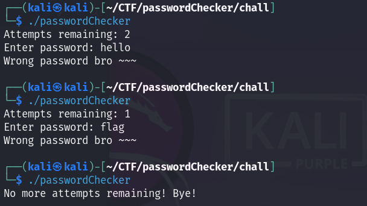
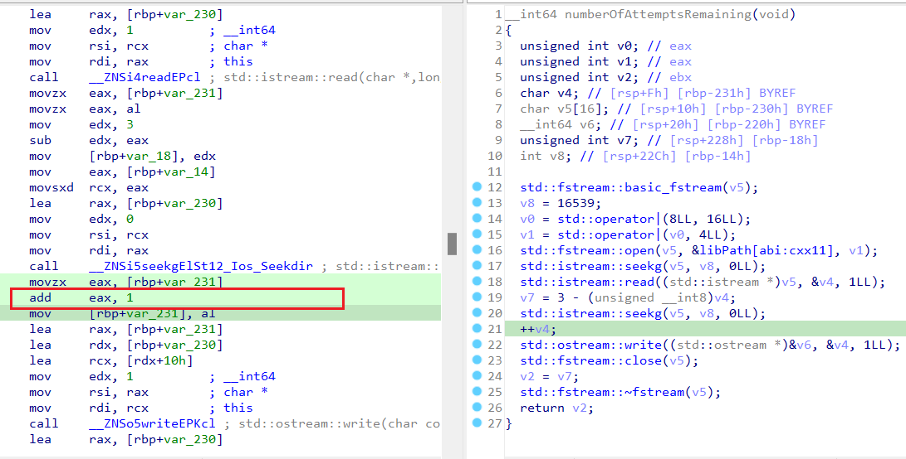
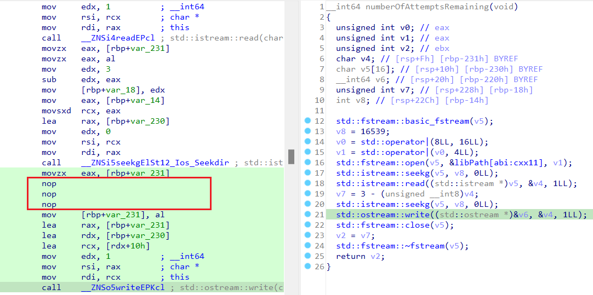
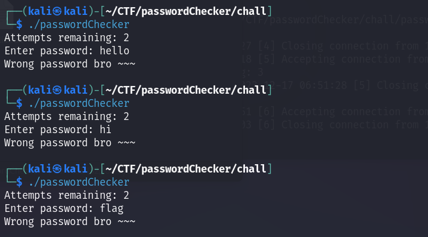

# password checker

**Category:** Reverse

**Level:** Intermediate

**Solves:** 1

**Description:** I've misplaced my password among this bunch of passwords. Can you help me find it?

**File:** [password_checker](../chall/rev_password_checker.rar)

# Solution

Chạy file elf



Chương trình thông báo số lần thử còn lại, yêu cầu nhập mật khẩu.

Nếu nhập sai, sẽ bị trừ số lần thử. Nếu đúng, sẽ in ra flag.

Nếu ban đầu số lượt thử là 0, chương trình in thông báo tạm biệt, xóa `hash.so` và xóa chính nó.

Do có `wordlist.txt` nên nghĩ ngay nó cần brute force.

Nhưng mà chương trình chỉ cho chạy sai 3 lần, nếu vậy không thể brute force được.

Vậy phải bypass kiểm tra số lần thử.

## Cách 1:

Ở hướng đi này, tôi tìm hiểu làm sao chương trình biết số lần thử còn lại là bao nhiêu. Vì thông thường dữ liệu sẽ bị reset mỗi lần chạy chương trình, làm sao nó nhớ được?

Mở file elf bằng IDA.

Trong hàm `main`:


Nhìn sơ bộ thì có vẻ chương trình gọi hàm `hash` trong `hash.so`.

Chú ý đến hàm `numberOfAttemptsRemaining`, hàm này trả về `v33`, sau đó biến này được in ra cùng chuỗi `Attempts remaining: `.

Vậy hàm này chính là hàm lấy số lần thử còn lại.

Tìm đến hàm `numberOfAttemptsRemaining`:


Hàm mở file `hash.so` (`std::fstream::open`), sau đó trỏ đến offset lưu tại `v8 = 16539` (`std::fstream::seekg`), đọc 1 byte tại đó (`std::fstream::read`), lưu vào `v4`.

Hàm này trả về `v2`, trước đó gán `v2` bằng `v7`.

Mà `v7` = 3 - `v4`.

Nên 3 - `v4` chính là số lần thử còn lại.

Chương trình cập nhật số lần thử bằng cách tăng `v4` lên 1 (`++v4`), sau đó ghi `v4` vào vị trí cũ (`std::fstream::seekg` và `std::fstream::write`).

Vậy thì cách đơn giản là cho `v4` không được tăng.

Patch lại chương trình.

Đầu tiên xem mã assembly của hàm `numberOfAttemptsRemaining`:



`++v4` được thực hiện bằng lệnh `add eax, 1`.

Patch `nop` vào lệnh này.



Save changes.

Vậy là xong, có thể brute force bình thường.



Script brute force:

```python
import subprocess

password_checker_path = './passwordChecker'
wordlist_path = 'wordlist.txt'

with open(wordlist_path, 'r') as file:
    for line in file:
        password = line.strip()

        process = subprocess.Popen(password_checker_path, stdin=subprocess.PIPE, stdout=subprocess.PIPE, stderr=subprocess.PIPE, text=True)
        output, error = process.communicate(input=password)

        if 'Wrong password' not in output:
            print(f"Password found: {password}")
            break

```
Kết quả:


Flag: `KCSC{tuyet_voi!!!qua_dep_trai_roi<3<3}`

## Cách 2:

Về mặt ý tưởng thì nếu biết rõ rằng hàm mã hóa chỉ là `hash` trong `hash.so` ta có thể chạy hàm đó luôn mà không cần qua `passwordChecker`.


Ở đây có thể thấy hàm `hash` nằm trong `hash.so` được gọi bằng cách dùng `dlopen` và `dlsym`, sau đó lưu vào `v34`.

Bên dưới, sau khi nhập password vào `v29`

Đặt `v18` = `v34`

Gọi hàm `v18(v28, v29)`

`v28` lưu kết quả mã hóa, sau đó được so sánh với mảng đã định nghĩa sẵn `target[abi:cxx11]`

Nếu bằng nhau thì gen flag.

Dễ dàng tìm được chuỗi tại `target[abi:cxx11]`: `b99aff88d8e71fba4bce610f4d3cbc8d`

Dưới đây là đoạn code để chạy hàm `hash` trong `hash.so`, brute force password trong `wordlist.txt` và so sánh kết quả với chuỗi `b99aff88d8e71fba4bce610f4d3cbc8d`:

```python
import ctypes

def hash(input_string):
    # Load the shared library
    hash_lib = ctypes.CDLL('./hash.so')

    # Set the argument and return types for the function
    hash_lib.hash.argtypes = [ctypes.c_char_p, ctypes.c_char_p]
    hash_lib.hash.restype = ctypes.c_void_p

    # Prepare the parameters for the function
    buffer_size = 32
    buffer = ctypes.create_string_buffer(buffer_size)
    input_string = input_string.encode('utf-8')

    # Call the function
    hash_lib.hash(buffer, input_string)

    # Get the hash value from the buffer
    address = int.from_bytes(buffer[:8], byteorder='little')
    string_pointer = ctypes.cast(address, ctypes.c_char_p)
    result_string = ctypes.string_at(string_pointer)

    return result_string.decode('utf-8') == "b99aff88d8e71fba4bce610f4d3cbc8d"

with open('wordlist.txt', 'r', encoding='utf-8', errors='ignore') as file:
    passwords = [line.strip() for line in file]
for password in passwords:
    if hash(password):
        print(f"Password found: {password}")
        break
```
Để có script này, cần phải biết rõ hàm `hash` trong `hash.so` cần nhận tham số gì, chuỗi trả về như thế nào.

Cái này các bạn đọc, debug một hồi là biết được.


## Cách 3:

Cách này hơi "tay to", đại khái là ta có thể copy `hash.so` và `passwordChecker` để dự phòng. Sau đó brute force, khi nào hết lần thử, 2 file bị xóa thì lấy bản copy phục hồi lại brute force tiếp.

Tôi không viết script cho cách này nhé :v

### Note:

Thuật toán mã hóa trong `hash.so` là md5 nhưng đã được thay đổi các hằng số.


# Hết


