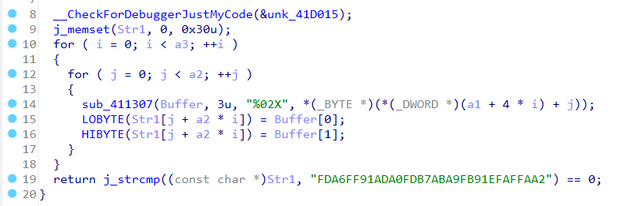
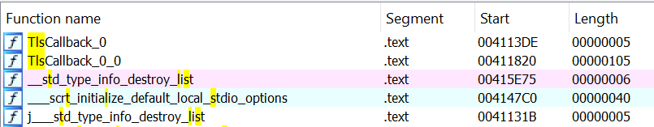
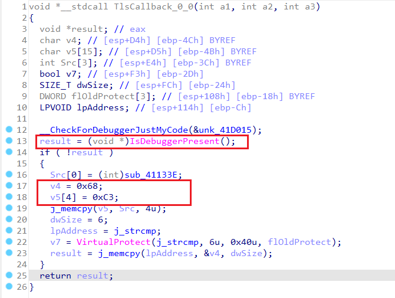
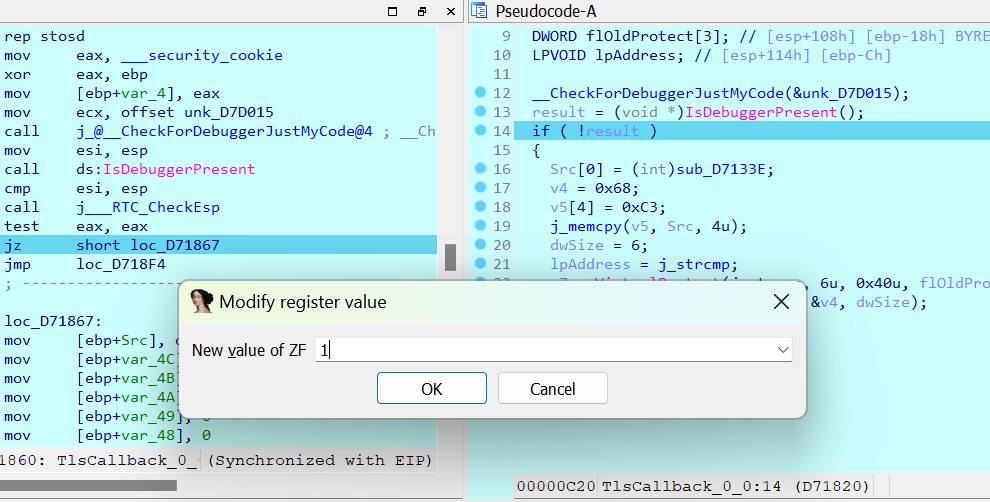

# two-faces

**Category:** Reverse

**Level:** Hard

**Solves:** 0

**Description:** Don't judge a book by its cover.

**File:** [two_faces](../chall/rev_two_faces.rar)

# Solution

Bài này khó không phải ở kiểu mã hóa, mà ở việc tìm ra được luồng đúng của chương trình.

Mở file exe bằng IDA.


Vẫn là lấy chuỗi, kiểm tra độ dài (phải là 22), pass vào hàm `sub_41137F`, kiểm tra format (phải là `KCSC{...}`), trích xuất chuỗi nằm trong cặp dấu ngoặc nhọn, lưu vào `Str`.

Chuỗi được trích xuất ra có độ dài là 16.

Chương trình định nghĩa ra `Block`, thực chất là mảng 2 chiều 4x4.

2 vòng `for` tiếp theo chỉ là gán giá trị cho `Block` dựa trên chuỗi `Str`.

Ví dụ:

`Str = "0123456789abcdef"` thì

`Block = [[0, 1, 2, 3], [4, 5, 6, 7], [8, 9, a, b], [c, d, e, f]]`

Tiếp đó là 100 vòng lặp biến đổi `Block` với 4 hàm `sub_4112F3`, `sub_411186`, `sub_411276`, `sub_4111A4`.

Về tác dụng của 4 hàm này, các bạn debug sẽ hiểu rất nhanh thôi.

Tổng quan:

`sub_4112F3`: shift rows, xoay trái các hàng của `Block` theo số thứ tự của hàng đó (bắt đầu từ 0).

`sub_411186`: shift columns, xoay lên các cột của `Block` theo số thứ tự của cột đó (bắt đầu từ 0).

`sub_411276`: swap hex, đảo 4 bit đầu với 4 bit cuối của từng phần tử trong `Block`.

`sub_4111A4`: xor, xor từng phần tử trong `Block` với 0x55 + vòng lặp hiện tại (bắt đầu từ 0).

Cuối cùng tạo chuỗi hex từ `Block`, so với chuỗi định sẵn.



Dễ dàng tìm được flag bằng cách đảo ngược quá trình trên.

```python
def unshift_rows(block):
    for i in range(4):
        block[i] = block[i][-i:] + block[i][:-i]
    return block

def unshift_columns(matrix):
    num_rows = len(matrix)
    num_cols = len(matrix[0])
    # Function to shift a column by 'shift' positions
    def unshift_one_column(col, shift):
        return [col[(i - shift) % num_rows] for i in range(num_rows)]

    # Shift each column by its index
    shifted_matrix = [[unshift_one_column([matrix[i][j] for i in range(num_rows)], j)[row] for j in range(num_cols)] for row in range(num_rows)]
    return shifted_matrix

def unswap_hex(block):
    for i in range(4):
        for j in range(4):
            block[i][j] = block[i][j] >> 4 | (block[i][j] & 0xf) << 4
    return block

def unxor(block, key):
    for i in range(4):
        for j in range(4):
            block[i][j] = block[i][j] ^ key
    return block

def main():
    target = "FDA6FF91ADA0FDB7ABA9FB91EFAFFAA2"
    # target to block 4x4
    block = [[target[i * 8 + j * 2: i * 8 + j * 2 + 2] for j in range(4)] for i in range(4)]
    # convert hex to int
    block = [[int(block[i][j], 16) for j in range(4)] for i in range(4)]

    # 100 rounds
    for i in range(100):
        block = unxor(block, 0x55 + 99 - i)
        block = unswap_hex(block)
        block = unshift_columns(block)
        block = unshift_rows(block)

    print("".join(["".join([chr(block[i][j]) for j in range(4)]) for i in range(4)]))


if __name__ == "__main__":
    main()

# 3a5y_ch41leng3_!

```

Flag: `KCSC{3a5y_ch41leng3_!}`

Nếu chỉ thế thôi thì làm sao mà độ khó là Hard được nhỉ?

Vì mấy bài Intermediate còn khó hơn như này nhiều.

Vấn đề ở đây, cũng là lý do cho cái tên `two-faces`, là một hàm có tên TLS callback.

> Thread-local storage (TLS) là một kỹ thuật trong lập trình đa luồng cho phép các biến được khai báo là local cho mỗi thread. Mỗi thread có một bản sao của các biến này, do đó mỗi thread có thể đọc và ghi các biến này mà không ảnh hưởng đến các thread khác.

> TLS callback là một hàm được gọi khi một thread được tạo ra hoặc kết thúc. Hàm này có thể được sử dụng để khởi tạo các biến local cho mỗi thread.

Vậy TLS callback ở đâu?

Chỉ cần search trong các tên hàm chuỗi `TLS`, kết quả như này:



Giờ phân tích nó một chút nhé.



`IsDebuggerPresent` là một hàm của Windows, nó kiểm tra xem chương trình có đang bị debug hay không. Đây dường như là cách chống debug đơn giản nhất.

Nếu xác định chương trình đang bị debug, hàm sẽ thoát luôn.

Điều thú vị xảy ra khi `IsDebuggerPresent` trả về 0 (chương trình không bị debug) và nhảy vào trong `if`.

Khá khó nhận ra, nhưng ở đây chương trình đang tạo một đoạn assembly rất nhỏ.
- sub_41133E: Hàm này ta sẽ nói đến sau.
- 0x68: Opcode của lệnh `push`.
- 0xC3: Opcode của lệnh `ret`.

Các bạn thấy hàm `j_strcmp` chứ? Nó là chỉ `strcmp` thôi, còn `VirtualProtect` để làm gì? Nó có tác dụng thay đổi quyền truy cập của một vùng nhớ.
- `j_strcmp`: Tham số đầu tiên là địa chỉ của vùng nhớ cần thay đổi quyền truy cập.
- 6u: Kích thước vùng nhớ cần thay đổi quyền truy cập.
- 0x40: Quyền truy cập mới (PAGE_EXECUTE_READWRITE).
- flOldProtect: Con trỏ trỏ đến biến lưu quyền truy cập cũ của vùng nhớ (Trong trường hợp này ta không cần quan tâm).

Sau khi thực thi hàm này, ta đã cấp quyền đọc, ghi, thực thi cho vùng nhớ trỏ bởi `j_strcmp`.

Tiếp đó, ta ghi mã assembly chuẩn bị bên trên vào vùng nhớ đó.

Cú pháp như sau:

```assembly
push sub_41133E
ret
```

Đoạn assembly này đẩy địa chỉ của hàm `sub_41133E` vào stack, sau đó `ret` sẽ lấy địa chỉ đó ra và nhảy đến đó.

Vậy là ta đã sửa lại hàm `strcmp`. Từ đây, mỗi khi gọi `strcmp`, đoạn assembly trên sẽ được thực thi, và ta sẽ nhảy đến hàm `sub_41133E`.

Hàm `sub_41133E`:


Đây mới chính là hàm kiểm tra thực sự.

Debug hàm này như nào? Chỉ cần đặt breakpoint tại `IsDebuggerPresent`, sau đó có thể sửa lại cờ `ZF` (zero flag) thay đổi luồng chương trình, nhảy vào trong `if`.




Đến đây thì logic quá rõ ràng rồi.

Xin sửa lại đoạn script như sau:

```python
...

def main():
    key = [7, 124, 0, 7, 127, 119, 120, 1, 0, 115, 7, 117, 0, 2, 3, 115, 7, 7, 0, 12, 7, 114, 123, 112, 4, 127, 3, 4, 7, 113, 0, 4]
    fake = "FDA6FF91ADA0FDB7ABA9FB91EFAFFAA2"

    target = ""

    for i in range(32):
        target += chr(ord(fake[i]) ^ key[i])

    ...

...

# function_h00k1ng

```

Flag: `KCSC{function_h00k1ng}`

# Hết


